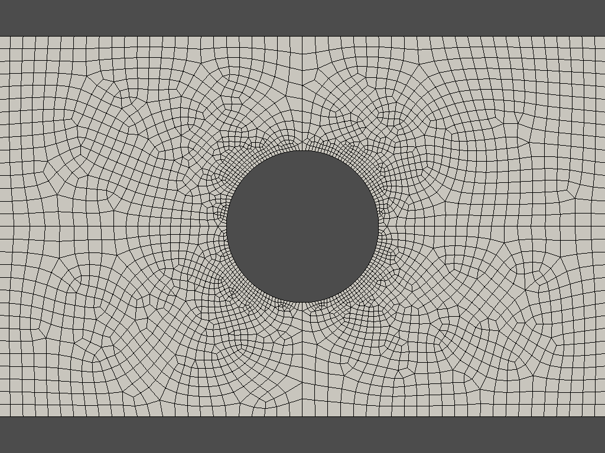
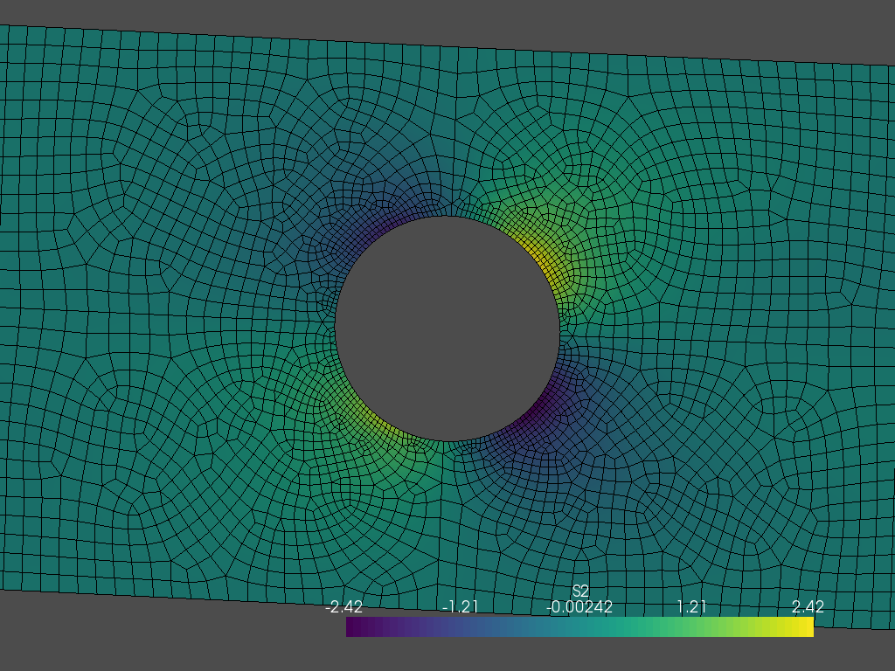

# Pybaqus

Pybaqus is a python library to import the output files generated by [Abaqus][1] in the ASCII `*.fil` format, and create a [VTK][2] object from the data.
The results can then be analyzed in pure python (i.e. no Abaqus licence needed) with the great tools provided by [PyVista][3].

# Features

Pybaqus is in a very early development stage.
Therefore, there are still many unimplemented functionalities.
However, basic operations like importing the mesh and the nodal and element results is implemented and can be used for some analysis.

The following features are either already implemented or planned:

- [x] Import 2D meshes
- [x] Import 3D meshes
- [x] Import nodal results
- [x] Import element results
- [x] Element and node sets
- [x] Extrapolate element results from Gaussian points to nodes _(implemented for some elements)_
- [ ] Import history output
- [x] Compute stresses along paths
- [ ] Compute section forces and moments
- [ ] Documentation

# Installation

```
pip install pybaqus
```

# Quick-start

The first thing you need is to tell Abaqus that you want an ASCII `*.fil` result file.
To get that you need to write the following lines in your `*.inp` file, within the step definition (before the `*End Step` command) e.g.:

```
...
*FILE FORMAT, ASCII
*EL FILE, DIRECTIONS=YES
S, E, COORD
*NODE FILE
COORD, U

*End Step
...
```

You can specify different output variables (as long as they are available for the elements you are using, of course).
After submitting your model you will get a `*.fil` file.
This is the file you need, as it can be imported with Pybaqus.

Import the `*.fil` file like this:

```python
from pybaqus import open_fil

res = open_fil("your_result.fil")

```

Great!
That was it. :)

Now you have your results as a VTK object, wrapped by PyVista, and there's nothing that can get in your way to analyze your results with pure python.

### Plot the mesh

```python
import pyvista as pv

mesh = res.get_mesh()


plot = pv.Plotter()
plot.add_mesh(mesh, show_edges=True, color="white")
plot.view_xy()
plot.show()
```



Cool! But something's missing there. Colors!
We can plot some of our results like this:

```python
mesh = res.get_deformed_mesh(step=1, inc=1, scale=3)
s2 = res.get_nodal_result(var="S2", step=1, inc=1)
mesh.point_arrays["S2"] = s2

plot = pv.Plotter()
plot.add_mesh(mesh, show_edges=True, color="white",
           scalars="S2", show_scalar_bar=True)
plot.view_xy()
plot.show()
```



That's it!
Since the API is still under development, some of these functions might change.

And now you can de whatever you want with your results in python.
Have fun!

[1]: https://www.3ds.com/products-services/simulia/products/abaqus/
[2]: https://vtk.org/
[3]: https://www.pyvista.org/
